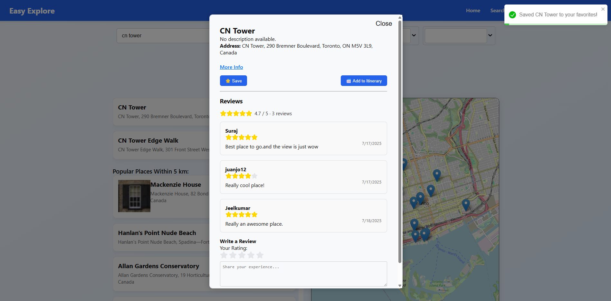

#  Easy Explore - User Walkthrough Guide

Welcome to **Easy Explore** — your ultimate travel companion! This guide provides a comprehensive step-by-step walkthrough for users to navigate the app, discover attractions, create itineraries, and collaborate with friends seamlessly.

---

## Table of Contents

1. [Accessing the App](#1-accessing-the-app)
2. [Creating an Account / Logging In](#2-creating-an-account--logging-in)
3. [Searching for Attractions](#3-searching-for-attractions)
4. [Viewing Attraction Details](#4-viewing-attraction-details)
5. [Saving Favorites](#5-saving-favorites)
6. [Building Your Itinerary](#6-building-your-itinerary)
7. [Collaborating with Friends](#7-collaborating-with-friends)
8. [Managing Your Profile](#8-managing-your-profile)
9. [Using Dark Mode](#9-using-dark-mode)
10. [Tips & Best Practices](#10-tips--best-practices)

---

## 1. Accessing the App

Open a modern browser and navigate to the live site:
[https://prj-566-ncc-team3.vercel.app](https://prj-566-ncc-team3.vercel.app)

* The homepage provides a clear entry point to search and explore attractions.
* Responsive design ensures usability across devices (desktop, tablet, mobile).

> 
> *Figure 1: Easy Explore Home Page*

---

## 2. Creating an Account / Logging In

**Creating an Account:**

1. Click **Sign Up** on the top navigation bar.
2. Enter your **Username**, **Email**, and **Password**.
3. Confirm your details and click **Register**.

**Logging In:**

1. Click **Login**.
2. Enter your credentials and click **Sign In**.
3. You will be redirected to your dashboard upon successful authentication.

> 
> *Figure 2: User Registration Page*

> 
> *Figure 3: User Login Page*

---

## 3. Searching for Attractions

* Use the **Search Bar** on the homepage or **Search** page to find attractions by keyword, country, state, or city.
* Refine your search with filters like **Category** and **Distance** to personalize results.

> 
> *Figure 4: Search Bar with Filters*

* Search results appear as a **list** and on an **interactive map**, allowing you to visually explore nearby attractions.

> 
> *Figure 5: Search Results with Map Integration*

---

## 4. Viewing Attraction Details

* Click any attraction card to view detailed information:

  * Description and overview
  * High-quality images
  * Location and address
  * Operating hours
  * User reviews and ratings

> 
> *Figure 6: Detailed Attraction Page*

---

## 5. Saving Favorites

* Click the **Save** icon on any attraction card or details page to add it to your **Favorites** list.
* Access your saved attractions via the **Saved Attractions** page from the navigation bar.

> 
> *Figure 7: Save an Attraction*

> 
> *Figure 8: Saved Attractions Page*

---

## 6. Building Your Itinerary

* Navigate to the **Itinerary** page to create and manage travel plans.
* Add attractions from search results or your saved favorites.
* Organize your itinerary by days and add notes for each location.
* Save and revisit your itinerary anytime.

> 
> *Figure 9: Itinerary Creation Interface*

---

## 7. Collaborating with Friends

* Share your itinerary by adding collaborators via **username** or **email**.
* Collaborators can:

  * View and edit the itinerary
  * Add comments
  * Suggest changes in real-time

> 
> *Figure 10: Adding Collaborators*

> 
> *Figure 11: Collaborators Successfully Added*

---

## 8. Managing Your Profile

* Access your profile through the navigation bar.
* Features include:

  * Edit personal information
  * View your saved attractions, itineraries, and reviews
  * Explore other users’ public profiles and itineraries

> 
> *Figure 12: User Profile Dashboard*

---

## 9. Using Dark Mode

* Toggle between **Light** and **Dark** themes for a comfortable viewing experience.
* The Dark Mode switch is available on the navigation bar for quick access.

> 
> *Figure 13: Dark Mode Toggle*

---

## 10. Tips & Best Practices

* **Use filters** to quickly find relevant attractions.
* **Save favorites** as you browse to easily build itineraries later.
* **Collaborate** to plan group trips effectively.
* **Check reviews** to discover hidden gems and avoid overcrowded spots.
* **Keep your profile updated** for personalized recommendations.

---

## Summary

**Easy Explore** provides an intuitive interface for planning trips, discovering attractions, and collaborating with friends. From search to itinerary sharing, all features are designed to deliver a seamless, user-friendly experience.

---

## Need Help?

If you have questions or encounter issues, contact the development team:

* **Ashwin BN** — Full-stack Developer ([GitHub](https://github.com/Ashwin-BN))
* **Alex Leung** — Frontend Collaborator ([GitHub](https://github.com/Alex-Leungg))
* **Jeelkumar Patel** — Frontend Collaborator ([GitHub](https://github.com/jeelpatel22))
* **Juan Moncayo** — Backend Collaborator ([GitHub](https://github.com/Juancinn))
* **Suraj Sapkota** — Backend Collaborator ([GitHub](https://github.com/surajsapkota))

---

*End of Walkthrough*

